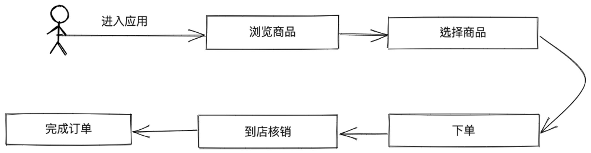
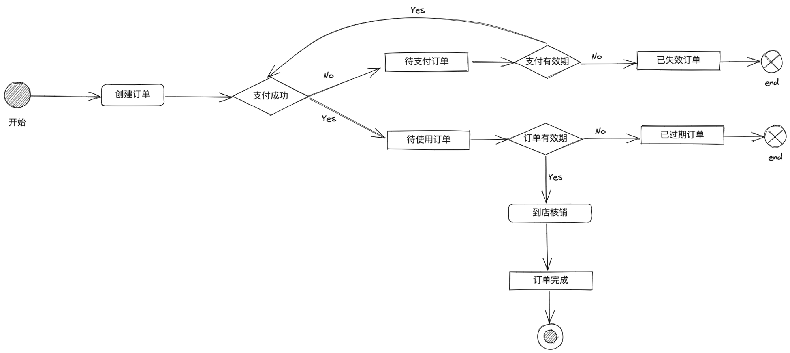
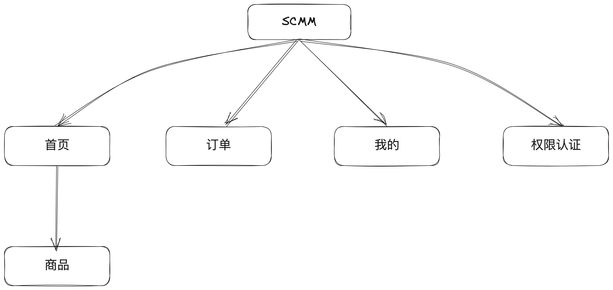
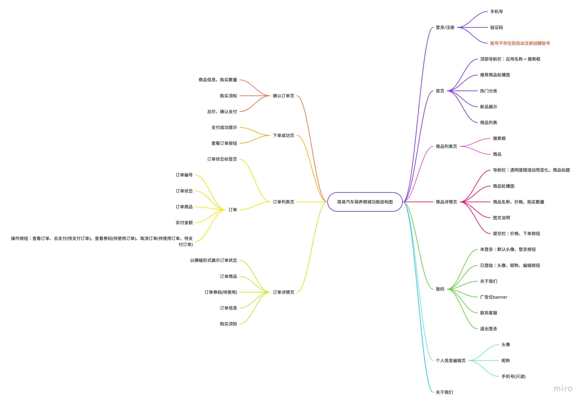

# 简易汽车保养商城

**简易汽车保养商城**（Simple Car Maintenance Mall，简称：SCMM），主要能实现商品预览、订单创建以及使用。运行于 H5 以及微信小程序。

## 需求规划

- 实现一个汽车保养服务电子商城(B2C)移动端界面
  - 主要功能：用户在应用程序里下单成功后，在订单有效期内到店，商家核销订单提供相应服务完成订单。
  - 主要流程：用户下单 → 用户到店 → 商家服务
  
- 首页以不同的形式展示商品，丰富视觉体验；
- 用户浏览商品后可直接下单，无需购物车功能；
- 商品详情页展示商品的信息：商品封面图、商品规格细节、商品图文描述；
- 订单列表页使用标签页展示不同的订单状态：全部、待支付、待使用、已完成、已取消。
- 订单详情页展示订单状态及详细信息


## 系统设计

### 项目组织


### 功能结构图


### 数据字典

|名称|别名|描述|定义|位置|
| :--- |:---|:---|:---:|---:|
|全部|全部订单|订单页面中的所有类型订单集合|0{数字}|订单信息|
|待支付|待支付订单|订单创建15分钟内未支付完成的订单|1{数字}|订单信息|
|待使用|待使用订单|订单已支付完成未核销过也未过期的订单|2{数字}|订单信息|
|已完成|已完成订单|在订单有效期内使用核销过的订单|3{数字}|订单信息|
|已取消|已取消订单|在有效期内已支付的订单，用户手动取消|4{数字}|订单信息|
|已失效|已失效订单|超时未支付的订单|5{数字}|订单信息|
|已过期|已过期订单|支付成功的订单超过订单有效期未使用|6{数字}|订单信息|
|是否支付有效期||未支付订单是否还可以继续支付|true{布尔}|订单信息|
|是否订单有效期||已支付成功的订单是否可以到店核销使用|true{布尔}|订单信息|
||
|原价|划线价|商品原价|0{数字}|商品信息|
|限购|最大可购买数量|同一个商品每个客户可购买的最大数量|0{数字}|商品信息|

### 对象属性

- 商品(ProductObj)
  
  <details><summary>代码</summary>

  ```typescript
  interface ProductObj {
    "id": number // 商品id
    "name": string // 商品名称
    "description": string // 描述
    "cover": string // 列表封面图
    "images": string[] // 轮播图
    "content": string // 富文本内容
    "price": number // 价格 (单位:元)
    "originPrice": number // 原价 (单位:元)
    "stock": number // 库存
    "maxPurchaseQuantity": number // 最大可购买数量
  }
  ```
  </details>

- 订单(OrderObj)
  
  <details><summary>代码</summary>

  ```typescript
  interface OrderObj {
    "id": number // 订单id
    "orderNumber": string // 订单编号
    "status": number // 订单状态
    "price": number // 订单价格（单位：元）
    "product": ProductObj // 订单商品
    "createdAt": string // 下单时间
    "paidAt": string // 支付时间
    "completedAt": string // 订单完成时间
    "availableAt": string // 订单有效期时间
    "code": string // 券码
    "quality": number // 购买数量
    "userId": number // 下单用户id
    "verificationCode": VerificationCodeObj[] // 核销码
  }

  interface VerificationCodeObj {
    id: number
    code: string // 核销码
    status: 0 | 1 //0未使用，1已使用
    updatedAt: string // status更新时间
  }
  ```

  </details>


- 用户(UserObj)
  <details><summary>代码</summary>

  ```typescript
  interface UserObj {
    "id": number // 用户id
    "nickname"?: string // 昵称
    "avatar"?: string // 头像
    "phone": string // 手机号
  }
  ```
  </details>

### 技术选型

- [Uni-App](https://uniapp.dcloud.net.cn/)：uni-app 是一个使用 Vue.js 开发所有前端应用的框架，开发者编写一套代码，可发布到iOS、Android、Web（响应式）、以及各种小程序（微信/支付宝/百度/头条/飞书/QQ/快手/钉钉/淘宝）、快应用等多个平台。

  <details><summary>跨端方案技术调研</summary>

  跨端方案要求只写一份代码就能运行到不同的平台上（H5、小程序(微信、支付宝、快手、京东...)、iOS、安卓）。之所以流行起“跨端”，根源在于 web 开发受到浏览器的过多限制并且需要花费精力适配不同浏览器，并且由于业务需要从不同平台引流时又需要针对不同平台开发功能相同的程序，增加了开发成本。

  跨端方案有很多，这里主要从 ***成熟度*** 、***生态活跃度*** 、***插件数量*** 、***开发效率*** 以及 ***运行性能*** 方面进行可行性分析，最后选择合适的方案。

  经过搜索，主要选择大厂提供的跨端方案进行对比分析，主要有：
  - 腾讯跨端框架 - [Hippy](https://github.com/Tencent/Hippy)
  - 京东跨端框架 - [Taro](https://github.com/NervJS/taro)
  - DCloud跨端框架 - [Uni-App](https://github.com/dcloudio/uni-app)
  - ~~滴滴跨端框架 - [Chameleon](https://github.com/didi/chameleon)~~
  
  ||发行时间|Star数量|Open Issue|UI框架|H5|小程序|App|插件数量|
  |:---|:---:|:---:|:---:|:---:|:---:|:---:|:---:|:---:|
  |Hippy|[2020-03-18](https://github.com/Tencent/Hippy/releases/tag/2.0.2)|6.9k|6|| ✅ | ❌ | ✅ |[25](https://github.com/orgs/hippy-contrib/repositories?type=all)|
  |Taro|[2020-04-13](https://github.com/NervJS/taro/releases/tag/v3.0.0-beta.0)|32k|879||✅|✅|✅|[200](https://taro-ext.jd.com/)|
  |Uni-App|[2018-07-28](https://uniapp.dcloud.net.cn/release-archive.html)|37.4k|1042||✅|✅|✅|[8346](https://ext.dcloud.net.cn/)|

  > 截止：2022/11/28

  WIP...

  </details>

- [Vue 3](https://cn.vuejs.org/)：是一款用于构建用户界面的 JavaScript 框架。它基于标准 HTML、CSS 和 JavaScript 构建，并提供了一套声明式的、组件化的编程模型，高效地开发用户界面。
- [TypeScript](https://www.typescriptlang.org/)：是一款强类型编程语言，JavaScript 的超集。使用 TypeScript 可以在编译时通过静态分析检测出很多常见错误，减少生产环境中的运行时错误，开发体验和效率也因 IDE 的中基于类型的自动补全得到了改善。Vue 3 使用 TypeScript 进行重写。
- [Vite](https://cn.vitejs.dev/)：前端工具链
- [UnoCSS](https://github.com/unocss/unocss)：即时按需的 CSS 原子引擎
  - [unocss-applet](https://github.com/unocss-applet/unocss-applet)：UnoCSS的小程序端兼容层，主要抹除小程序端不支持的语法。
- [Pinia](https://pinia.vuejs.org/zh/index.html)：一个组合式 API 的 Vue 状态管理库
  - [pinia-plugin-persistence-mp](https://github.com/side-projects-list/pinia-plugin-persistence-mp)：兼容 Uni-App 的 Pinia 持久化存储适配层。

### 开发工具

- [VS Code](https://code.visualstudio.com/)：轻量且强大的代码编辑器，丰富的插件支持，内置支持 JavaScript、TypeScript 和 Node.js。
  - [Volar](https://marketplace.visualstudio.com/items?itemName=Vue.volar)：VS Code 的高性能 Vue 语言插件，对于 Vue 3的支持度更友好。
  - [ESlint](https://marketplace.visualstudio.com/items?itemName=dbaeumer.vscode-eslint)：VS Code 的 ESLint 集成，可在保存文件时直接格式化代码。
  - [UnoCSS](https://marketplace.visualstudio.com/items?itemName=antfu.unocss)：UnoCSS的 VS Code 插件，主要用于装饰和提示匹配到的工具类。
- [Node.js](https://nodejs.org/)：使用版本 `v16.15.0`
- [pnpm](https://pnpm.io/)：快速切磁盘占用量小的 Node.js 包管理器。

### UI视觉规范

<details><summary>色彩</summary>

  - 行为相关
    - 主色：<div style="width:14px;height:14px;border-radius:2px;display:inline-block;background:#385aff;"></div> `#385aff`
    - 成功色：<div style="width:14px;height:14px;border-radius:2px;display:inline-block;background:#19C572;"></div> `#19C572`
    - 异常色(价格色)：<div style="width:14px;height:14px;border-radius:2px;display:inline-block;background:#eb483f;"></div> `#eb483f`
  - 文字相关
    - 基本色：<div style="width:14px;height:14px;border-radius:2px;display:inline-block;background:#333333;"></div> `#333333`
    - 反色：<div style="width:14px;height:14px;border-radius:2px;display:inline-block;background:#ffffff;"></div> `#ffffff`
    - 辅助色：<div style="width:14px;height:14px;border-radius:2px;display:inline-block;background:#999999;"></div> `#999999`
    - 标题：<div style="width:14px;height:14px;border-radius:2px;display:inline-block;background:#000000;"></div> `#000000`
    - 标签：<div style="width:14px;height:14px;border-radius:2px;display:inline-block;background:#666666;"></div> `#666666`
  - 背景相关
    - 页面背景色：<div style="width:14px;height:14px;border-radius:2px;display:inline-block;background:#ffffff;"></div> `#ffffff`
    - 灰色背景：<div style="width:14px;height:14px;border-radius:2px;display:inline-block;background:#f8f8f8;"></div> `#f8f8f8`
    - 元素占位背景色：<div style="width:14px;height:14px;border-radius:2px;display:inline-block;background:#eeeeee;"></div> `#eeeeee`

</details>

<details><summary>间距</summary>

通用间距，特殊情况可适当调整

  - 元素与页面的间距：`16px`
  - 元素内间距：`16px`
  - 元素间间距：`16px`

</details>

<details><summary>圆角</summary>

  - 圆角1：`4px`
  - 圆角2：`12px`
  - 圆角3：`50%`

</details>

<details><summary>交互</summary>

  - 表单提交型按钮：点击之后按钮状态变为 ***loading*** ，待请求完成后一出 ***loading*** 状态
  - 表单提交完后使用 ***redirectTo*** 方法跳转其它页，避免回退到表单提交页二次提交
  - 列表型页面：触底加载，底部加上“***加载更多***”、“***加载中***”、“***没有更多了~***”等文字状态
  - 空内容页：图文显示空内容提示

</details>

### 项目工程化
WIP...

### 模块化
遵循单一出口/入口原则。

WIP...

### 组件化

- 基础组件
  - [x] 按钮组件，[文档](./docs/components/sc-button.md)
  - [x] 弹框组件，[文档](./docs/components/sc-popup.md)
  - [x] 顶部导航栏组件
  - [ ] 瀑布流组件
  - [x] 标签组件
  - [ ] 二维码组件
  - [ ] 滑动切换标签组件
  - [x] 图标组件
  - [x] 加载更多
  - [x] 空内容
  - [x] 步进器
  - [x] 返回顶部
  - [x] 倒计时

- 业务组件
  - [ ] 订单
  - [ ] 订单商品
  - [ ] 商品
    - [ ] 商品列表 - 商品
    - [ ] 搜索结果 - 商品

### 代码规范

<details><summary>@antfu/eslint-config: ESlint 代码检查的预设配置</summary>

  - 单引号、无分号
  - 格式化时自动修复
  - TypeScript 和 Vue 的开箱支持
  - json、yaml 和 markdown的支持
  - 导入排序
  - 零配置直接使用

</details>

<details><summary>Git Hook: 结合各种 lint，在 git 提交代码的时候进行代码风格校验，如果校验没通过，则不会进行提交</summary>

  - [husky](https://typicode.github.io/husky/#/)：当您提交或推送时，您可以使用它来格式化提交消息、运行测试、格式化代码等。 Husky 支持所有 Git 钩子。
  - [lint-staged](https://github.com/okonet/lint-staged)：在 git 暂存文件上运行 linters

</details>

<details><summary>commitlint: 用于校验 git 提交信息规范</summary>

  **Git 提交规范**
  - 参考 [vue](https://github.com/vuejs/vue/blob/dev/.github/COMMIT_CONVENTION.md) 规范 ([Angular](https://github.com/conventional-changelog/conventional-changelog/tree/master/packages/conventional-changelog-angular))
    - `feat` 增加新功能
    - `fix` 修复问题/BUG
    - `style` 代码风格相关无影响运行结果的
    - `perf` 优化/性能提升
    - `refactor` 重构
    - `revert` 撤销修改
    - `test` 测试相关
    - `docs` 文档/注释
    - `chore` 依赖更新/脚手架配置修改等
    - `workflow` 工作流改进
    - `ci` 持续集成
    - `mod` 不确定分类的修改
    - `wip` 开发中
    - `types` 类型修改

</details>

#### 命名规范

- 变量、函数：驼峰命名法（camelCase）
  > 不二次赋值的let变量（由ESlint自动将let转const）
- 常量：下划线分隔的全大写单词（CONST_NAME）
- 类、接口、类型以及枚举：帕斯卡命名法（PascalCase）
- 组件：以 `sc-` 为前缀外加组件名组成，存放于 `components` 目录，如：`components/sc-order/sc-order.vue`
- 视图/页面：`模块名/页面名/index.vue` 形式，如：`order/detail/index.vue`，`页面名`使用 `kebab-case` 命名法，建议最好一个单词
- TS/JS文件：短横线命名法（kebab-case）

- 函数/方法： [^1]
  - 命名方法：驼峰命名法（camelCase）
  - 命名规范：动词 + 名词
  - 命名建议：常见动词约定
    |动词|含义|返回值|
    |:---|:---|:---|
    |`can`|判断是否可执行某个动作(权限)|函数返回一个布尔值。true：可执行；false：不可执行|
    |`has`|判断是否含有某个值|函数返回一个布尔值。true：含有此值；false：不含有此值|
    |`is`|判断是否为某个值|函数返回一个布尔值。true：为某个值；false：不为某个值|
    |`get`|获取某个值|函数返回一个非布尔值|
    |`set`|设置某个值|无返回值、返回是否设置成功或者返回链式对象|
    |`load`|加载某些数据|无返回值或者返回是否加载完成的结果|
    |`on`|监听某些行为|无返回值|
    |`handle`|处理某些事件|无返回值|

- 注释：推荐使用多行注释(`/*...*/`)类型，VS Code有良好的注释提示，只需鼠标悬浮在有多行注释的标识符上就会有提示框

- 其它参考
  - [TypeScript 代码整洁之道](https://github.com/pipiliang/clean-code-typescript)

### 项目目录

<details><summary>代码</summary>

```bash
tree -a -L 3 -I '*node_modules*|*dist*|*.git'

.
├── .editorconfig
├── .eslintignore
├── .eslintrc-auto-import.json
├── .eslintrc.js
├── .gitignore
├── .husky
│   ├── _
│   │   ├── .gitignore
│   │   └── husky.sh
│   ├── commit-msg
│   ├── common.sh
│   ├── lintstagedrc.js
│   └── pre-commit
├── .nvmrc
├── .vscode
│   ├── extensions.json
│   └── settings.json
├── CHANGELOG.md
├── README.md
├── commitlint.config.js
├── docs
│   └── images
├── index.html
├── package.json
├── pnpm-lock.yaml
├── src
│   ├── App.vue
│   ├── auto-imports.d.ts
│   ├── env.d.ts
│   ├── main.ts
│   ├── manifest.json
│   ├── pages
│   │   └── index
│   ├── pages.json
│   ├── static
│   │   └── logo.png
│   └── uni.scss
├── tsconfig.json
├── unocss.config.ts
└── vite.config.ts
```
</details>

### 外部设计资源引用

[图标](https://www.iconfont.cn/collections/detail?spm=a313x.7781069.1998910419.d9df05512&cid=42837)
[插画1](https://www.iconfont.cn/illustrations/detail?spm=a313x.7781069.1998910419.dc64b3430&cid=41775)
[插画2](https://www.iconfont.cn/illustrations/detail?spm=a313x.7781069.1998910419.d9df05512&cid=38302)

## 开发

- 初始化

  ```bash
  git clone git@github.com:side-projects-list/scmm-weapp.git
  cd scmm-weapp
  pnpm i

  git checkout -b dev-someone # 创建自己的开发分支
  ```

- 本地开发
  
  ```bash
  pnpm dev:h5 # h5 开发
  pnpm dev:mp-weixin # 微信小程序开发
  ```

- 打包
  
  ```bash
  pnpm build:h5 # 构建 h5 打包产物
  pnpm build:mp-weixin # 构建 微信小程序打包产物
  ```

- 热修复开发

  线上环境出现bug，创建新分支优先解决问题。

  ```bash
  git checkout -b hotfix/some-bug # 创建热修复分支
  git commit -am 'fix: 修复的问题' && git push # 修复bug提交代码，并发起 PR 请求
  git checkout dev-someone && git pull && git merge main # 热修复代码 PR 通过合并到主分支，并将主分支的代码合并到自己的开发分支
  git branch -d hotfix/some-bug # 删除已验证合并的热修复分支
  ```

- 功能开发

  临时增加的开发功能，不属于原本迭代规划中，需要临时开发部署上线。

  ```bash
  git checkout -b feature/some-feature # 创建功能分支
  git commit -am 'feat: 新功能' && git push # 提交代码，并发起 PR 请求
  git checkout dev-someone && git pull && git merge main # 功能代码 PR 通过合并到主分支，并将主分支的代码合并到自己的开发分支
  git branch -d feature/some-feature # 删除已验证合并的功能分支
  ```

---

[^1]: [JavaScript 开发规范（一）： 命名与注释规范详解](https://juejin.cn/post/6844903492415406088)
